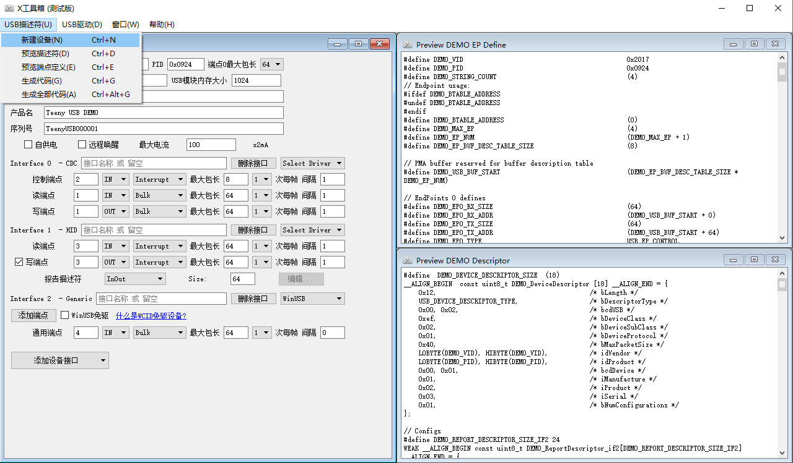
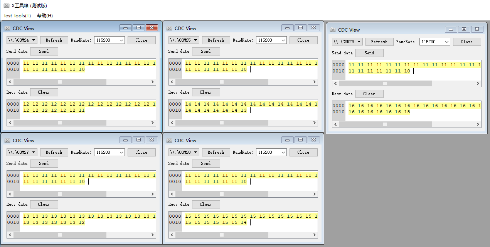
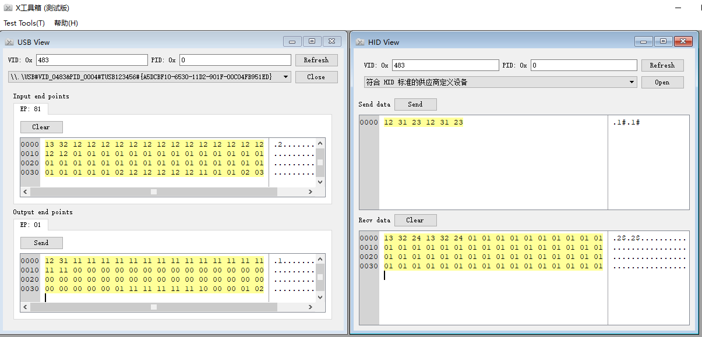

Teeny USB
==========
Not only a teeny USB stack for STM32 devices, but also a toolset to create USB descriptors and drivers.

# 特性
1. 支持的例程：串口(CDC)，多串口(CDC x 5)，自定义HID，自定义批量(bulk)。
2. 使用lua脚本生成USB相关描述符，并根据描述符自动生成初始化配置代码。
3. 根据USB描述自动生成驱动文件，并对驱动文件签名。
# Feature
1. Demo for CDC, multiple CDC, Custom HID, Custom Bulk (No driver need, even no inf)
2. USB descriptor generation by lua script and UI tool
3. Driver inf generation (based on libwdi)

# 目录结构说明 Folder
[usb_stack](./usb_stack) TeenyUSB协议栈的源码 Source code of TeenyUSB

[TeenyDT](./TeenyDT) 描述符自动生成工具及源码 Source code of USB descriptor tool

[pc_test_tool](./pc_test_tool) PC端测试工具及源码 Source code for USB device test tool

# TeenyUSB协议栈 Stack

STM32 USB FS模块调用关系如下图


# TeenyDT 描述符工具 Descriptor Tool

## UI操作方式


## 命令行方式

```bat
lua gen_descriptor demo.lua -maxep=7 -maxmem=1024
```
TeenyDT版本描述符示例，Demo of descriptor in TeenyDT
```lua
return Device {
    strManufacture = "TeenyUSB",
    strProduct = "TeenyUSB CDC",
    strSerial = "TUSB123456",
    idVendor = 0x0483,
    idProduct = 0x0002,
    prefix = "CDC",
    Config {
        CDC_ACM{
            EndPoint(IN(3),  Interrupt,  64),
            EndPoint(IN(1),  BulkDouble, 64),
            EndPoint(OUT(2), BulkDouble, 64),
        },
   }
}
```
更多示例 More Demo：[Custom Bulk](usb_stack/demo/custom_bulk/custom_bulk_desc.lua)，[CDC](usb_stack/demo/cdc/cdc_desc.lua)，[CDCx5](usb_stack/demo/cdc5/cdc5_desc.lua)，[MSC](usb_stack/demo/msc/msc_desc.lua)，[Custom HID](usb_stack/demo/custom_hid/hid_desc.lua)

# USB测试工具 Test Tool
串口测试 Serial Port



HID测试




