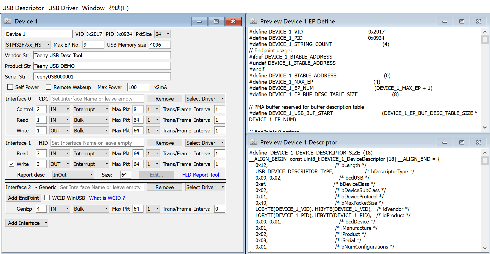

Teeny USB
==========
A teeny USB stack for STM32 MCUs, also contain a toolset to create USB descriptors and drivers.

关于TeenyUSB的实现细节和使用方式请阅读《STM32 USB设备开发指南》 [Github下载](https://github.com/xtoolbox/TeenyUSB/releases/download/0.1/STM32_USB_desgin_guide.pdf) , [21IC下载](http://dl.21ic.com/download/stm32_usb-285543.html)

# 特性
1. 设备例程：串口，5路串口，自定义HID，自定义设备批量传输(无需驱动)。
2. 主机例程：无协议栈主机，键盘鼠标+HUB。
3. 使用lua脚本生成USB相关描述符，并根据描述符自动生成初始化配置代码。
4. 根据USB描述自动生成驱动文件，并对驱动文件签名。
# Feature
1. Device demo: CDC, multiple CDC, Custom HID, Custom Bulk (No custom driver need, even no inf)
2. Host demo: raw host, hub+keyboard+mouse
4. USB descriptor generation by lua script and UI tool
5. Driver inf generation (based on libwdi)

# 目录结构说明 Folder
[usb_stack](./usb_stack) TeenyUSB协议栈的源码 Source code of TeenyUSB

[TeenyDT](./TeenyDT) 描述符自动生成工具及源码 Source code of USB descriptor tool

[pc_test_tool](./pc_test_tool) PC端测试工具及源码 Source code for USB device test tool

# TeenyUSB协议栈 TeenyUSB Stack

## 示例 demos

## USB设备例程 Demo for device

| Demo Folder      |      Demo Type       |  Tested Board  |
|------------------|----------------------|----------------|
| custom_bulk      | 自定义 Bulk 设备     | All Below      |
| cdc              | 虚拟串口 CDC         | All Below      |
| msc              | 虚拟U盘 Mass Storage | All Below      |
| custom_hid       | 自定义 HID 设备      | All Below      |
| cdc5             | 5路 CDC              | All Below      |
| CubeMXF107       | CubeMX+TeenyUSB  自定义设备   | STM32F107VCT6 |
| CubeMXF303       | CubeMX+TeenyUSB  自定义设备   | [STM32F3 Disco][303] |
| CubeMXF723       | CubeMX+TeenyUSB  自定义设备   | [stm32f723e discovery][723] |

## USB主机例程 Demo for host

| Demo Folder      |      Demo Type       |  Tested Board  |
|------------------|----------------------|----------------|
| host_raw         | 无协议栈主机 Raw Host| 723            |
| host_input       | HUB+KeyBoard+Mouse   | 723            |

## USB OTG例程 Demo for OTG
| Demo Folder      |      Demo Type       |  Tested Board  |
|------------------|----------------------|----------------|
| host_rtt         | OTG in [rtthread][rtt]   | [stm32f723e_disco][723] |

接入普通USB线时，工作在设备模式，FS设备默认为CDC串口，HS设备默认为U盘，使用板载QSPI，可以通过命令行更改设备角色，重新插拔后生效。

接入OTG线时，工作在主机模式，主机采用修改后的[rtthread][rtt] USB主机协议栈，目前支持HUB，U盘，键盘和鼠标。

When plug with normal USB cable, work in device mode, the FS core is CDC and HS core is MSC by default. The device role can be changed through the command.

When plug with OTG cable, work in host mode, support HUB, Mass storage, keyboard and mouse devices.


## Demo测试用的开发板 Demo tested on boards

| Board Folder     |      Board Type             |      Chip     |HSE Freq | Tested USB Core     |
|------------------|-----------------------------|---------------|---------|---------------------|
| stm32f0          | Custom board                | STM32F072C8T6 | No HSE  | USB FS              |
| stm32f1          | Custom board                | STM32F103RET6 | 8 MHz   | USB FS              |
| stm32f407_evk    | [Waveshare EVK407I][407]    | STM32F407IGT6 | 8 MHz   | OTG_FS/OTG_HS_ULPI  |
| stm32f723e_disco | [stm32f723e discovery][723] | STM32F723IEK6 | 25 MHz  | OTG_FS/OTG_HS_Embed |
| stm32767zi_nucleo| [stm32f767zi nucleo][767]   | STM32F767ZIT6 | 8 MHz   | OTG_FS              |

[767]: https://www.st.com/en/evaluation-tools/nucleo-f767zi.html
[723]: https://www.st.com/en/evaluation-tools/32f723ediscovery.html
[407]: http://www.waveshare.net/wiki/EVK407I
[303]: https://www.st.com/en/evaluation-tools/stm32f3discovery.html
[rtt]: https://github.com/RT-Thread/rt-thread


# TeenyDT 描述符工具 TeenyDT Descriptor Tool

## UI操作方式 GUI




## 命令行方式 Command Line

```bat
lua gen_descriptor.lua demo.lua -maxep=7 -maxmem=1024
```
TeenyDT版本描述符示例，Demo of descriptor in TeenyDT
```lua
return Device {
    strManufacture = "TeenyUSB",
    strProduct = "TeenyUSB CDC",
    strSerial = "TUSB123456",
    idVendor = 0x0483,
    idProduct = 0x0002,
    prefix = "CDC",
    Config {
        CDC_ACM{
            EndPoint(IN(3),  Interrupt,  64),
            EndPoint(IN(1),  BulkDouble, 64),
            EndPoint(OUT(2), BulkDouble, 64),
        },
   }
}
```
更多示例 More TeenyDT Descriptor Demo：[Custom Bulk](usb_stack/demo/custom_bulk/custom_bulk_desc.lua)，[CDC](usb_stack/demo/cdc/cdc_desc.lua)，[CDCx5](usb_stack/demo/cdc5/cdc5_desc.lua)，[MSC](usb_stack/demo/msc/msc_desc.lua)，[Custom HID](usb_stack/demo/custom_hid/hid_desc.lua)

# USB测试工具 USB Test Tool
串口测试 Serial Port Viewer


HID测试 HID Viewer


