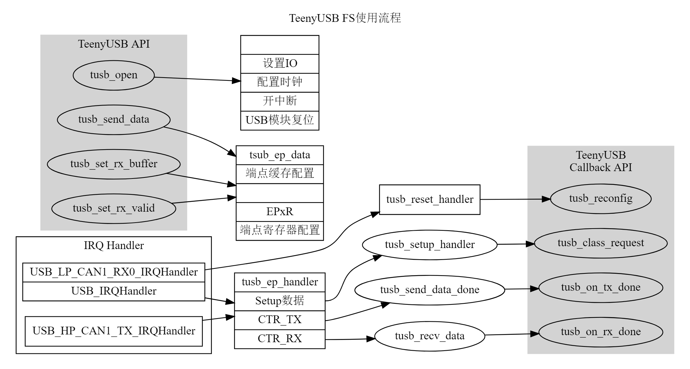
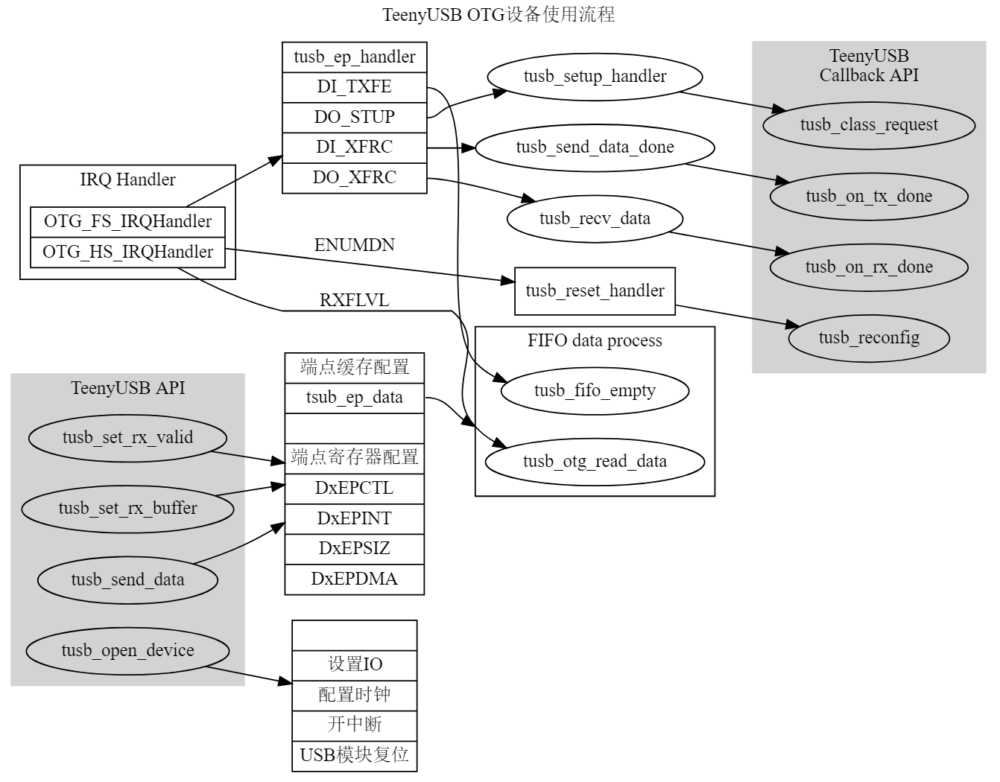
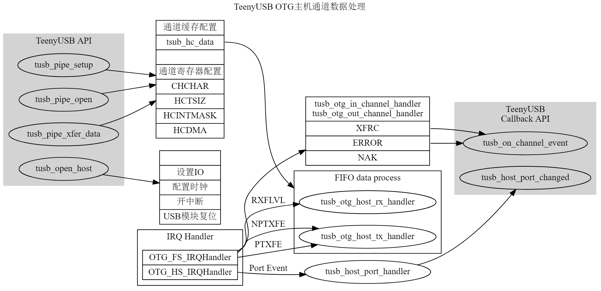

TeenyUSB Stack
==========

# 设备接口函数 Device API

普通函数 Normal function

|  function name    |  description                  |
|-------------------|-------------------------------|
|tusb_get_device    | Get chip USB device handle    |
|tusb_open          | Open USB Device, Connect      |
|tusb_close         | Close USB device, Disconnect  |
|tusb_send_data     | Send endpoint data            |
|tusb_set_rx_buffer | Set OUT endpoint recv buffer  |
|tusb_set_rx_valid  | Set OUT endpoint valid        |

回调函数，用户实现 Callback function

|  function name            |  description                  |
|---------------------------|-------------------------------|
|tusb_reconfig              | Config endpoint here          |
|tusb_class_request         | Class request                 |
|tusb_on_rx_done            | Data received                 |
|tusb_on_tx_done            | Data send finish              |
|tusb_get_report_descriptor | Report descriptor request     |

# Host API

普通函数 Normal function

|  function name        |  description                         |
|-----------------------|--------------------------------------|
|tusb_get_host          | Get chip USB host handle             |
|tusb_open_host         | Open USB host                        |
|tusb_close_host        | Close USB host                       |
|tusb_host_port_reset   | Set host port reset state            |
|tusb_pipe_open         | Open/allocate pipe for data transfer |
|tusb_pipe_close        | Close/free pipe                      |
|tusb_pipe_setup        | Transfer setup packet                |
|tusb_pipe_xfer_data    | Transfer data packet                 |
|tusb_pipe_wait         | Wait/Get pipe transfer state         |

回调函数，用户实现 Callback function

|  function name            |  description         |
|---------------------------|----------------------|
|tusb_host_port_changed     | Port state changed   |
|tusb_on_channel_event      | Changed event        |

# 函数处理流程

## USB FS模块

## USB OTG模块设备模式 Device

## USB OTG模块主机模式 Host

